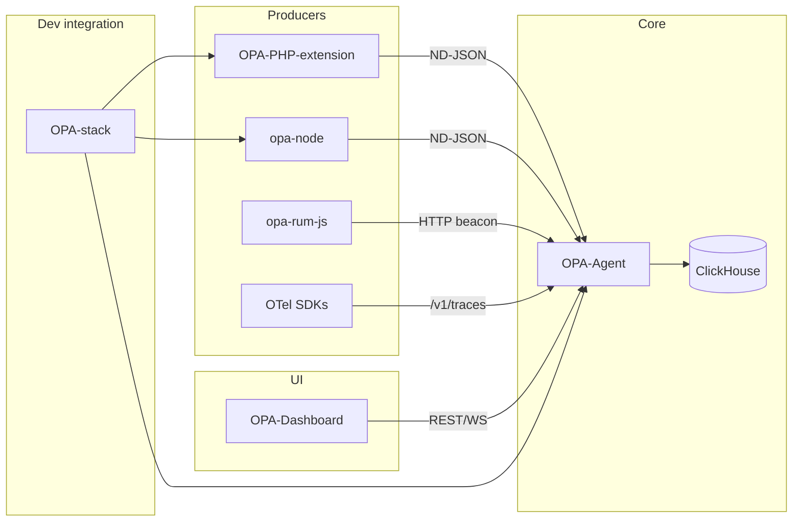

# OPA product roadmap (local)

> **Local only** — gitignored via `docs/ROADMAP.local.md` in OPA-stack `.gitignore`.  
> Last updated: 2026-07-30.

## Executive summary

- **Vision:** Self-hosted APM for PHP and polyglot stacks — traces, errors, logs, RUM, reliability, and thin perf/AppSec verticals without vendor lock-in.
- **Maturity:** Waves 1–27 scaffolded/shipped on tip branches; Waves 28–30 thin verticals (replay player, perf lab, AppSec hub) in progress on `wave28-30-verticals`.
- **Honesty:** Late waves are contracts + demos until depth spikes land; do not claim eBPF/cloud inventory/commercial load-test/AppSec parity.

---

## Repo map

| Repo | Path | Role |
|------|------|------|
| **OPA-Agent** | `../OPA-Agent` | Go collector: ND-JSON + OTLP ingest, ClickHouse writer, admin/query API, auth, alerts/SLOs/anomalies/synthetics workers, WebSocket, Prometheus |
| **OPA-Dashboard** | `../OPA-Dashboard` | React/Vite SPA: traces, errors, RUM, logs, reliability pages, admin |
| **OPA-PHP-extension** | `../OPA-PHP-extension` | PHP 8.x C extension: auto profiling, SQL/HTTP/Redis/cache, W3C propagation, ND-JSON to agent |
| **opa-node** | `../opa-node` | Zero-dep Node ≥18 SDK: HTTP in/out, `fetch`, W3C `traceparent`, manual SQL/Redis |
| **opa-rum-js** | `../opa-rum-js` | Browser RUM beacon: Core Web Vitals, AJAX, errors, sessions, trace correlation |
| **OPA-stack** | `.` | Integration smoke stack (compose + harnesses), OIDC stub, ClickHouse init, historical audit |

---

## Wave history (completed)

### Wave 1 — Security & correctness (Agent)

**Commits:** `ce205b3`, `9bcf31a`

- SQL injection hardening (`safeTimeLiteral`, `safeSortDir`, `isColumnIdent` in `OPA-Agent/utils.go`)
- Accurate `/api/errors` counts (JOIN dedupe)
- Unit tests + CI vet/test gate (`utils_test.go`, `.github/workflows/docker-build.yml`)

### Wave 2 — Alerts / SLOs / Anomalies

**Commits:** Agent `0efc747`, `61f2be4`; Dashboard `d849312`

- Alerts, SLOs, Anomalies backends (`alert_worker.go`, `anomaly_detector.go`, `wave2_workers.go`)
- SLO evaluator writes `burn_rate` to `opa.slo_metrics`
- Anomaly scheduler (env-gated)
- Dashboard Reliability nav: Alerts, SLOs, Anomalies (`SideRail.jsx`)

### Wave 3 — Dashboard depth & power UX

**Commits:** Dashboard `a190085` … `50b53ab`

- Auth UX, denser IA, Live hub, drill-downs
- Flame/call graphs, variable dumps, trace export, threshold editing
- Saved views, compare cohorts, theme/palette (C5)

### Wave 4 — OTLP ingest + distributed waterfall + RUM detail

**Commits:** Agent `adc5e0a`, `47f8739`; Dashboard `72e8239`, `74b6e37`

- **D1:** OTLP/protobuf ingest on `POST /v1/traces` (`otlp_ingest.go`)
- **D2:** RUM detail aggregates (`/api/rum/detail`)
- **D3:** Service-aware distributed waterfall (`TraceExplorer.jsx`)

### Wave 5 — Tenant schema, TTLs, hardened auth profile

**Commits:** Agent `1eac50e`, `b6d1788`

- **E1:** Tenant columns on control-plane tables (`schema.go`)
- **E2:** Retention TTLs on raw/history tables (`schema.go`, `BootstrapSchema`)
- **A2/E4:** `OPA_AUTH_REQUIRED` + stable `JWT_SECRET`; HttpOnly cookie path (`auth.go`, `main.go`)

---

## Post-wave shipped (unnumbered)

Shipped after Wave 5, not tied to a wave label:

| Area | What shipped | Evidence |
|------|--------------|----------|
| SSO | OIDC login + admin user/role management | `OPA-Agent/oidc.go`, `OPA-Dashboard/src/pages/Login.jsx` |
| Redaction | Universal PII scrub on ingest (opt-in `OPA_REDACT`) | `OPA-Agent/redact.go`, PHP `opa.redact_sql` |
| OTLP export | Opt-in via `OTEL_EXPORTER_OTLP_ENDPOINT` | `OPA-Agent/otlp.go` |
| Tail sampling | Policy-driven keep/drop after trace completion | `OPA-Agent/tail_sampling.go` |
| Distributed stitching | Cross-service trace assembly + aggregate flame profiling | Agent + Dashboard profiling views |
| Edge traces | nginx/Apache trace-context origination | `OPA-Agent/integrations/reverse-proxy/` |
| Logs | Ingest + `/api/logs` + Dashboard Logs page | `OPA-Dashboard/src/pages/Logs.jsx` |
| Synthetics | Scheduled HTTP checks + Dashboard page | `OPA-Agent/synthetics.go`, `Synthetics.jsx` |
| RUM sessions | Browser sessions API + AJAX↔trace correlation | `opa-rum-js` v0.2, Agent RUM APIs |
| Node SDK v0.2 | Global `fetch` + route templates | `opa-node/README.md` |
| Hardening | Tenant isolation on panel endpoints, real SMTP, leak fixes | `4cc3dda` |

---

## Pillar scorecard

| Pillar | Status | Evidence |
|--------|--------|----------|
| Traces / distributed | **Done** | PHP, Node, Agent, Dashboard; W3C propagation end-to-end |
| OTLP traces (ingest + export) | **Done** | `otlp_ingest.go`, `otlp.go` |
| OTLP metrics / logs | **Open** | No `/v1/metrics` or `/v1/logs` |
| RUM | **Done** | `opa-rum-js`, Agent APIs, `BrowserRum.jsx` |
| Logs | **Done** | Ingest, `/api/logs`, `Logs.jsx` |
| Synthetics | **Done** | `synthetics.go`, `Synthetics.jsx` |
| Alerts | **Partial** | Static thresholds; SMTP when `OPA_SMTP_HOST` set; no PagerDuty/Opsgenie |
| SLOs | **Partial** | CRUD + evaluator + `burn_rate` metrics; no burn-rate-based alerts |
| Anomalies | **Done** (basic) | Statistical detection + scheduler |
| Auth | **Done** (opt-in) | JWT, OIDC, API keys; `OPA_AUTH_REQUIRED` off by default |
| HA / scale | **Open** | In-memory `TailBuffer`, single-node service map |
| Audit log | **Open** | No tamper-evident audit trail for control-plane ops |
| PHP extension | **Done** (core) | `opa.full_capture_threshold_ms` still no-op |
| Node SDK | **Partial** | HTTP/fetch; manual SQL/Redis only |
| Deployment | **Partial** | Smoke stack only; no prod HA/TLS runbook |

---

## Forward waves

### Wave 6 — Enterprise hardening (near-term)

Focus: close the gap between "works in dev" and "safe in prod".

| ID | Task | Repo(s) | Notes |
|----|------|---------|-------|
| F6-1 | Auth-on-by-default migration guide + dashboard guard | Agent, Dashboard, OPA-stack | `OPA_AUTH_REQUIRED` still off; see `OPA-Agent/main.go` ~L1020 |
| F6-2 | Audit log for write/delete/control ops | Agent | login, key CRUD, trace delete, sampling/config changes |
| F6-3 | SLO burn-rate → alert conditions | Agent, Dashboard | `burn_rate` in `wave2_workers.go`; alerts static in `alert_worker.go` |
| F6-4 | Alert channel expansion (PagerDuty/Opsgenie/Teams) | Agent | webhook/slack/email only today |
| F6-5 | Document + OpenAPI the undocumented dashboard endpoints | Agent | `/api/http-calls`, `/api/redis/operations`, `/api/filter-suggestions/*` |
| F6-6 | PHP `full_capture_threshold_ms` — implement or remove | PHP extension | Registered in `opa.c:36`, never read |
| F6-7 | Production deployment guide (TLS, nginx headers, auth env) | OPA-stack | Smoke compose exists; no prod runbook |

### Wave 7 — Observability completeness

| ID | Task | Repo(s) |
|----|------|---------|
| F7-1 | OTLP metrics ingest (`/v1/metrics`) | Agent |
| F7-2 | OTLP logs ingest (`/v1/logs`) | Agent |
| F7-3 | Custom metrics UI + trace correlation | Dashboard |
| F7-4 | Per-tenant ingestion quotas + cardinality caps | Agent |
| F7-5 | Node auto-instrumentation (`pg`, `mysql2`, `ioredis`) | opa-node |

### Wave 8 — Scale & polyglot

| ID | Task | Repo(s) |
|----|------|---------|
| F8-1 | Stateless ingest tier (queue + trace-ID sharding) | Agent |
| F8-2 | HA compose / k8s reference | OPA-stack |
| F8-3 | Python/Go thin SDKs (or document OTLP-only path) | new repos or docs |
| F8-4 | Queue/gRPC instrumentation in PHP extension | PHP extension |

---

## Cross-repo dependency diagram

---

## Open backlog (audit triage)

Source: [`docs/AUDIT-2026-07-23.md`](AUDIT-2026-07-23.md) — header notes several findings are **superseded**. Status below reflects current codebase, not the audit snapshot.

### Security & auth

| Theme | Status | Notes |
|-------|--------|-------|
| Hardcoded JWT secret | **Fixed** | `JWT_SECRET` env required when `OPA_AUTH_REQUIRED=1` |
| Open registration → admin escalation | **Fixed** | Role assignment gated |
| API-key tenant bypass | **Fixed** | Hardening pass |
| Unauthenticated API-key management | **Fixed** | Wrapped in `AuthMiddleware` |
| Auth off by default | **Partial** | Mechanism exists; not default (`main.go` ~L1020) |
| WebSocket unauthenticated / CSWSH | **Partial** | Origin check + token on handshake added; verify under auth profile |
| JWT in localStorage | **Partial** | HttpOnly cookie path when auth enforced; localStorage still used in some flows |
| No audit log | **Open** | — |
| SAML / SCIM | **Open** | OIDC done (`oidc.go`) |
| Admin cross-tenant view | **Open** | TODO in `multi_tenant.go:117` |

### Correctness & performance

| Theme | Status | Notes |
|-------|--------|-------|
| ClickHouse batch data loss / races | **Fixed** | Flush locking + error handling improved |
| Graceful shutdown | **Fixed** | Signal handler + `srv.Shutdown` in `main.go` |
| spans_full per-span inserts | **Fixed** | Batching aligned with spans_min |
| PHP blocking transport | **Partial** | Timeouts added; verify all paths |
| Dashboard code splitting | **Fixed** | `React.lazy` + `manualChunks` in `vite.config.js` |
| ExecutionStackTree O(n²) | **Partial** | Precomputed parent map; virtualization behind `VIZ_V2` |
| Per-request PHP globals / ZTS | **Partial** | ZTS macro fixed; verify threaded SAPI |

### Feature gaps

| Theme | Status | Notes |
|-------|--------|-------|
| OTLP ingest/export (traces) | **Fixed** | `otlp_ingest.go`, `otlp.go` |
| W3C trace context (PHP) | **Fixed** | Inbound parse + outbound cURL injection |
| Distributed tracing end-to-end | **Fixed** | PHP, Node, edge, RUM correlation |
| Data retention / TTL | **Fixed** | `schema.go` TTLs on raw + control-plane |
| PII redaction | **Partial** | Agent + PHP opt-in; not universal default |
| Tail-based sampling policies | **Partial** | Tail buffer + manual keep; limited auto policies |
| SLO burn-rate alerts | **Open** | Metrics computed; alerts not wired |
| Alert channel maturity | **Partial** | SMTP real when configured; no PagerDuty etc. |
| Metrics pipeline | **Open** | Span-derived only; no OTLP metrics |
| HA / horizontal scale | **Open** | In-memory state |
| PHP-only instrumentation | **Partial** | Node SDK exists; Python/Go absent |
| Node auto DB/Redis | **Open** | Manual `recordSql` / `recordRedis` only |
| API contract completeness | **Partial** | Undocumented dashboard endpoints remain |

---

## Suggested kickoff order (Wave 6)

1. **F6-3** — SLO burn-rate alerts (highest user-visible reliability gap)
2. **F6-1** — Auth migration guide + enforce in stack harness
3. **F6-2** — Audit log (enterprise blocker)
4. **F6-5** — API contract completeness
5. **F6-6** — PHP `full_capture_threshold_ms` cleanup
6. **F6-7** — Production deployment guide
7. **F6-4** — Alert channel expansion

---

## Waves 12–30 maturity (honest, 2026-07-30)

| Wave | Band | Status |
|------|------|--------|
| 12 RUM depth / replay ingest | Hard XL | Capture + chunks; **player** in Wave 28 |
| 13–16 | Hard XL / OSS | Partial; JVM/.NET / full CH cluster still deferred |
| 17–22 | Mid scaffold | Stronger contracts; TF provider = stub only |
| 23–27 | Late scaffold | P0 honesty (residency, mock labels, bytes) + depth spikes on tip |
| **28 Experience replay** | Thin vertical | Timeline API + Dashboard player + synthetics artefacts |
| **29 Perf lab** | Thin vertical | Scenarios/runs + load-runner + CI gate examples (single-runner) |
| **30 AppSec hub** | Thin vertical | OSV opt-in, secrets ingest, PR check, IAST examples — not full SAST/IaC |

Depth-review Phase 1 (honesty/smoke) completed on `wave27-diagnostics`. Phase 2–3 + Waves 28–30 land on `wave28-30-verticals`.

---

## Source TODOs (in code)

| Item | File |
|------|------|
| Roadmap-deferred auth default | `OPA-Agent/main.go` ~L1021 |
| Admin-wide tenant view | `OPA-Agent/multi_tenant.go:117` |
| Email fallback when SMTP unset | `OPA-Agent/alert_worker.go` ~L418 |
| PHP `full_capture_threshold_ms` unused | `OPA-PHP-extension/src/opa.c:36` |

---

## References

- Historical audit (verify per item): [`docs/AUDIT-2026-07-23.md`](AUDIT-2026-07-23.md)
- API contract: [`../OPA-Agent/docs/AGENT_API_CONTRACT.md`](../OPA-Agent/docs/AGENT_API_CONTRACT.md)
- Smoke stack: [`docker-compose.yaml`](../docker-compose.yaml)
- RUM setup: [`../OPA-Dashboard/RUM_SETUP.md`](../OPA-Dashboard/RUM_SETUP.md)
- Node SDK: [`../opa-node/README.md`](../opa-node/README.md)
- Edge trace-context: [`../OPA-Agent/integrations/reverse-proxy/README.md`](../OPA-Agent/integrations/reverse-proxy/README.md)
